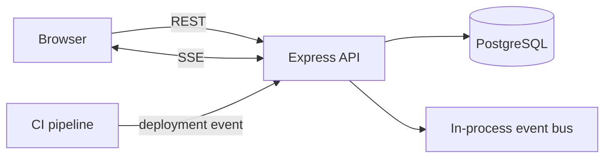

# ReleasePulse

A deployment and service-health control center for engineering teams. ReleasePulse brings environment status, recent deployments, approvals, and live operational events into one place instead of spreading them across CI logs and chat messages.

## Live demo

**[Open ReleasePulse →](https://rahulk030.github.io/releasepulse/)**

The public GitHub Pages version runs in a browser-only portfolio demo mode with representative deployment data, approval actions, status changes, and simulated live updates. The repository also contains the full Node.js/PostgreSQL implementation for local development.

## Highlights

- Tracks releases across development, staging, and production environments.
- Streams deployment events to the UI with Server-Sent Events (SSE).
- Adds a lightweight approval gate for production releases.
- Shows deployment activity, calculated success rate, environment health, and incident context in a control-center UI.
- Uses structured validation, request IDs, health checks, and centralized error handling.
- Ships with Docker Compose and GitHub Actions CI.

## Stack

- **Frontend:** Vue 3, TypeScript, Pinia
- **Backend:** Node.js, TypeScript, Express
- **Database:** PostgreSQL
- **Realtime:** Server-Sent Events
- **Validation / security:** Zod, Helmet, CORS
- **Testing:** Vitest, Supertest
- **Delivery:** Docker, GitHub Actions

## Architecture



## Why SSE?

The UI only needs one-way operational updates from server to browser. SSE keeps the protocol simple, works over standard HTTP infrastructure, and automatically reconnects in modern browsers. WebSockets would be reasonable if the product later needed bidirectional collaboration.

## Local development

```bash
cp .env.example .env
docker compose up -d db
cd services/api && npm install && npm run dev
cd ../../apps/web && npm install && npm run dev
```

## Example workflow

1. A CI pipeline posts a new deployment to `POST /api/deployments`.
2. The API validates and persists the release.
3. The event bus publishes the change to connected dashboards.
4. Production releases remain `awaiting_approval` until an approver accepts them.
5. The dashboard updates without a full-page refresh.

## API surface

```http
GET  /api/deployments?environment=production&status=failed
POST /api/deployments
POST /api/deployments/:id/approve
GET  /api/events
GET  /health
```

## Author

**Rahul Kumar Maurya** · Full Stack Developer · Toronto, ON  
GitHub: [rahulk030](https://github.com/rahulk030)
